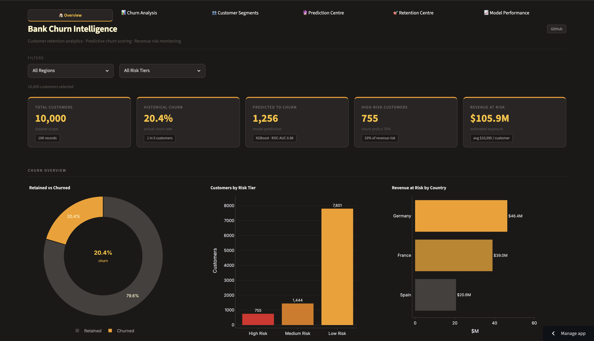
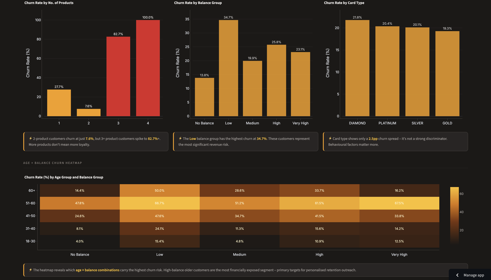
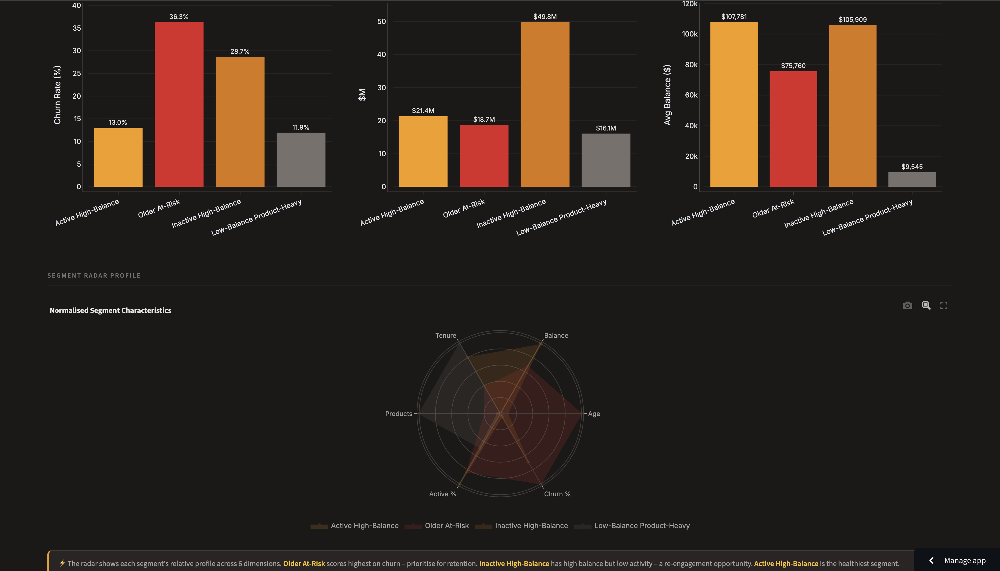
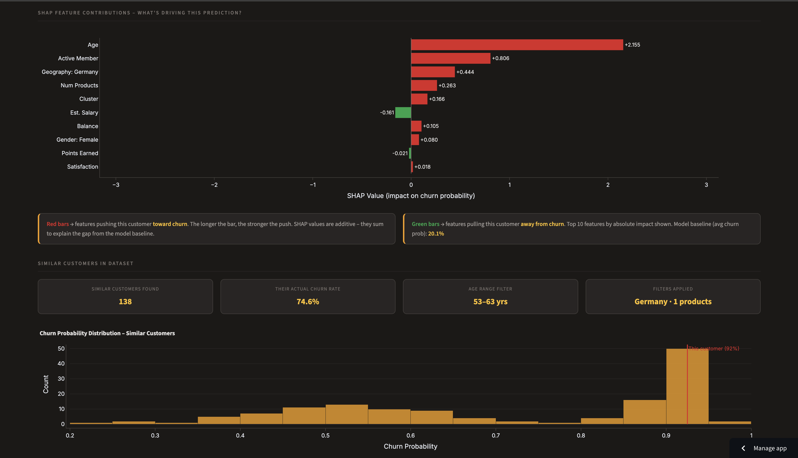
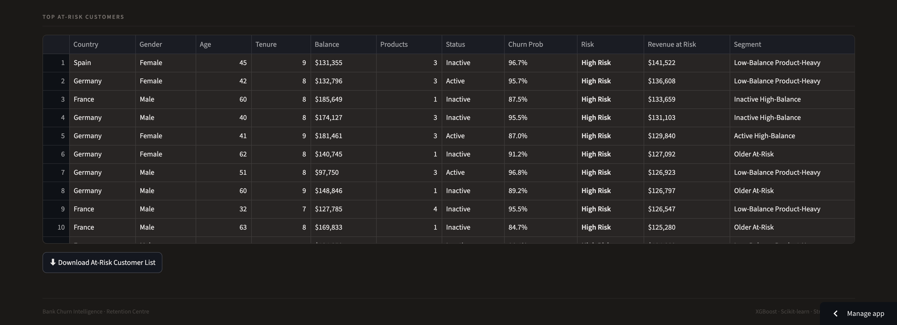
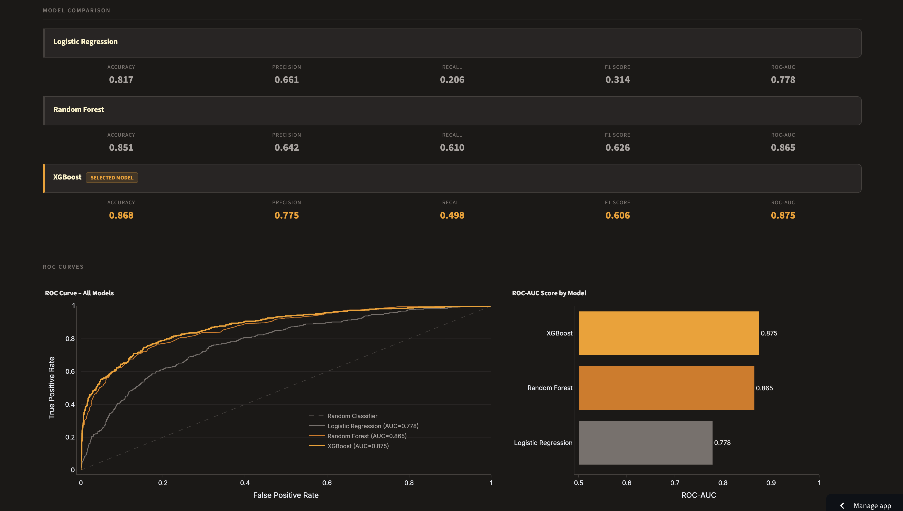

# 🏦 Bank Churn Intelligence

> End-to-end customer churn prediction and retention analytics dashboard built with Python, XGBoost, SHAP, and Streamlit.

   

🔗 **[Live Demo](https://bank-churn-intel.streamlit.app/)**

---

## Executive Summary

Keeping existing customers is usually cheaper than finding new ones. This project uses data analysis and machine learning to:

- Find customers who may leave the bank
- Understand the main reasons why customers leave
- Estimate how much revenue may be lost
- Group customers into useful customer types
- Show clear predictions and retention suggestions in an interactive dashboard

---

## Screenshots

### Overview Dashboard

*Headline KPIs, churn overview charts, and revenue at risk by geography and customer type*

### Churn Analysis

*Shows how churn changes across different age and balance groups*

### Customer Segments

*Compares 4 customer groups across 6 areas using a normalised radar chart*

### Prediction Centre – Live SHAP Explainability

*Real-time SHAP waterfall chart showing individual feature contributions to each churn prediction*

### Retention Centre

*Shows a filterable list of high-risk customers, ranked by revenue at risk. The list can be downloaded as a CSV file*

### Model Performance

*Compares Logistic Regression, Random Forest, and XGBoost using model scores and ROC curves*

---

## Project Structure

```text
bank-churn-intelligence/
│
├── data/
│   ├── bank_customer_churn.csv               # Raw dataset (10,000 records)
│   ├── cleaned_bank_churn.csv                # Cleaned data with new features
│   ├── segmented_bank_churn.csv              # Data with K-Means customer groups
│   ├── churn_predictions.csv                 # Churn probabilities and risk levels
│   └── revenue_at_risk.csv                   # Estimated revenue at risk for each customer
│
├── models/
│   ├── churn_prediction_model.joblib         # Saved XGBoost pipeline
│   ├── shap_explainer.pkl                    # SHAP explainer for individual predictions
│   ├── shap_feature_names.pkl                # Names of the 20 processed features
│   └── model_performance_results.pkl         # Saved model scores, ROC data and confusion matrices
│
├── notebooks/
│   ├── 01_data_understanding.ipynb           # Understand and check the dataset
│   ├── 02_data_cleaning_feature_engineering.ipynb  # Clean data and create features
│   ├── 03_custom_churn_eda.ipynb             # Explore churn patterns
│   ├── 04_customer_segmentation.ipynb        # Create customer groups with K-Means
│   ├── 05_churn_prediction_model.ipynb       # Train and test models then export SHAP files
│   └── 06_revenue_at_risk.ipynb              # Calculate revenue at risk
│
├── pages/
│   ├── 1_Churn_Analysis.py                   # Churn patterns by customer type and behaviour
│   ├── 2_Customer_Segments.py                # Customer groups and segment explorer
│   ├── 3_Prediction_Centre.py                # Live churn prediction and SHAP explanation
│   ├── 4_Retention_Centre.py                 # At-risk customers and retention ideas
│   └── 5_Model_Performance.py                # Model scores, ROC curves and confusion matrices
│
├── screenshots/
│   ├── dashboard_overview.png
│   ├── dashboard_filters.png
│   ├── churn_analysis_demographics.png
│   ├── churn_analysis_heatmap.png
│   ├── customer_segments_personas.png
│   ├── customer_segments_radar.png
│   ├── prediction_low_risk.png
│   ├── prediction_high_risk.png
│   ├── prediction_shap.png
│   ├── retention_playbook.png
│   ├── retention_table.png
│   ├── model_performance_metrics.png
│   ├── model_performance_roc.png
│   └── model_performance_confusion.png
│
├── app.py                                    # Main app and overview page
├── utils.py                                  # Shared styling, navigation and chart tools
├── requirements.txt
├── .gitignore
└── README.md
```

---

## Dataset

**Source:** Bank Customer Churn Dataset (Kaggle)

| Property | Value |
|---|---|
| Records | 10,000 customers |
| Original features | 18 |
| Engineered features | 4 (AgeGroup, BalanceGroup, TenureGroup, SalaryGroup) |
| Segmentation feature | 1 (Cluster) |
| Churn rate | 20.38% |
| Missing values | None |
| Duplicates | None |

**Target variable:** `Exited` 
- 1 = Churned (customer left the bank)
- 0 = Retained (customer stayed)

---

## Dashboard Pages

### 🏠 Overview
The Overview page shows the most important results, including:

- Total number of customers
- Past churn rate
- Number of customers predicted to leave
- Number of high-risk customers
- Total estimated revenue at risk

It also includes charts for churn, risk levels, age, country and product use. Users can filter the results by country and risk level.

### 📊 Churn Analysis
This page studies churn across:

- Customer details: gender, age and country
- Customer behaviour: activity, complaints and satisfaction
- Bank products: number of products, balance group, and card type

It also includes an age and balance heatmap that makes high-risk customer groups easy to find.

### 👥 Customer Segments
K-Means clustering divides customers into four groups:

| Cluster | Customer Type | Churn Risk |
|---|---|---|
| 0 | Active High-Balance | Low (13%) |
| 1 | Older At-Risk | High (36%) |
| 2 | Inactive High-Balance | Medium-High (29%) |
| 3 | Low-Balance Product-Heavy | Low (12%) |

The page includes customer group cards, risk labels, a radar chart, comparison charts, and a churn breakdown for each group.

### 🔮 Prediction Centre
This page uses the saved XGBoost model to predict whether an individual customer may leave. After entering a customer profile, the user receives:

- A live churn probability shown on a gauge chart
- A Low, Medium or High risk label
- A **SHAP waterfall chart** showing which features increased or reduced the risk
- A comparison with similar customers

### 🎯 Retention Centre
Business-focused retention toolkit:
- Filtered at-risk customer table (adjustable probability threshold and segment)
- Revenue exposure charts by region and segment
- Churn probability vs balance scatter plot
- Retention playbook with prioritised strategies per segment
- Downloadable at-risk customer CSV

This page helps the bank decide which customers to contact first. It includes:

- A filterable table of at-risk customers
- Controls for churn probability and customer group
- Revenue-at-risk charts by country and customer group
- A chart comparing churn probability and customer balance
- Suggested retention actions for each customer group
- A downloadable CSV file of at-risk customers

### 📈 Model Performance
This page compares three machine learning models using saved results, so it loads quickly. It includes:

- Accuracy, Precision, Recall, F1 and ROC-AUC scores
- ROC curves for all three models
- Confusion matrices showing correct and incorrect predictions

---

## Modelling

### Models Evaluated

| Model | Accuracy | Precision | Recall | F1 | ROC-AUC |
|---|---|---|---|---|---|
| Logistic Regression | 0.817 | 0.661 | 0.206 | 0.314 | 0.778 |
| Random Forest | 0.851 | 0.642 | 0.610 | 0.626 | 0.865 |
| **XGBoost** ✓ | **0.868** | **0.775** | **0.498** | **0.606** | **0.875** |

**XGBoost** was selected as the final model based on highest ROC-AUC score of 0.875 and best overall predictive performance.

### Features Used

```
CreditScore, Geography, Gender, Age, Tenure, Balance, NumOfProducts,
HasCrCard, IsActiveMember, EstimatedSalary, SatisfactionScore,
CardType, PointEarned, Cluster
```

> **Important:** The `Complain` feature was not used to train the model. When it was included, the model achieved an almost perfect ROC-AUC score of about 1.0. This showed that complaints were too closely linked to the answer and could make the model look unrealistically accurate. This problem is called data leakage.

**Understanding the Predictions**
SHAP (SHapley Additive exPlanations) explains why the model gives each prediction. The dashboard uses SHAP’s `TreeExplainer` to create a live waterfall chart for any customer profile. The chart shows which features increase churn risk and which features reduce it. The model’s average starting churn probability is about 20.1%.

---

## Revenue at Risk Framework

The dataset does not include full customer transaction history. Because of this, the project uses a simple estimate of customer value:

```
CustomerValueScore = 0.40 × BalanceScore
                   + 0.30 × SalaryScore
                   + 0.20 × TenureScore
                   + 0.10 × PointsScore

EstimatedCustomerValue = CustomerValueScore × EstimatedSalary
RevenueAtRisk          = EstimatedCustomerValue × ChurnProbability
```
This means balance has the highest weight, followed by salary, account length and reward points.

**Estimated total revenue at risk: about $105.9 million.**

---

## Tech Stack

| Category | Tools |
|---|---|
| Language | Python 3.11 |
| Dashboard | Streamlit, Plotly |
| Machine Learning | Scikit-learn, XGBoost |
| Explainability | SHAP |
| Data | Pandas, NumPy |
| Clustering | Scikit-learn KMeans |
| Visualisation | Plotly, Matplotlib, Seaborn |
| Version Control | Git, GitHub |

---

## Key Findings

- **Germany** has the highest churn rate at 32.4% vs ~16% for France and Spain
- **Inactive customers** have a churn rate of 26.9%, compared with 14.3% for active customers
- **Customers who complained** have a 99.5% churn rate. Solving complaints quickly may be one of the best ways to reduce churn
- **Customers with two products** have the lowest churn rate at 7.6%. Churn rises to 82.7% or more for customers with three or more products
- **Customers aged 51–60** have the highest churn rate at 56.2%
- **Cluster 1: (Older At-Risk)** has the highest individual churn risk at 36%
- **Cluster 2: (Inactive High-Balance)** has the highest total revenue at risk at about $49.8 million

---

## How to Run

```bash
git clone https://github.com/Nihira11/bank-churn-intelligence.git
cd bank-churn-intelligence
pip install -r requirements.txt
streamlit run Dashboard.py
```

---

## Future Improvements

- Connect the dashboard to a live database for real-time updates
- Use a more detailed customer value model when transaction data becomes available
- Add automatic PDF business reports
- Build a full customer lifetime value model using transaction history

---

## Author

Portfolio Project – Customer Churn Prediction & Retention Analytics  
Built as part of a data science portfolio targeting fintech and quantitative analytics roles
